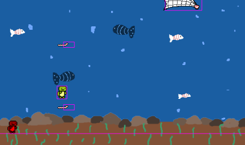

<h1 align="center">Turtle Dodge</h1>

A small and simple multiplayer game done with Phaser and Socket.io

<h1>Content</h1>
<ul>
 <li><a href="#info">What's the game about<a/></li>
  <li><a href="#how">How to play<a/></li>
 <li><a href="#insta">Installation in local<a/></li>
 <li><a href="#made">Made With<a/></li>
</ul>
 
<h2 align="center" id="info">What's the game about</h2>

In Turtle Dodge you an another player become a turtle that are chilling in the sea when suddenly a lot of trash starts coming your way. Dodge plastic straws, bags and fishing nets as you try to survive for as long as possible (probably not more than 1 minute). 

<h2 align="center" id="how">How to play</h2>

In order to play Turtle dodge you can either play it <a href="https://turtledodge.herokuapp.com/">online</a> or host it locally in your computer with the instructions below. Whichever option you decide for you will still need to get a second player to start the game (if you wanna play solo you can open two webpages at let the other one die).  
<h2 align="center" id="insta">Installation</h2>

If you want to install TurtleDodge in your computer so you don't have to connect to heroku or just wanna play locally with some people you need to clone this repo, install <a href="https://nodejs.org/en/download/">Node</a> and run (in the repo directory) the command: "node index.js"

<h2 align="center" id="made">Made With</h2>

This game was done using <a href="http://phaser.io/">Phaser 3</a> and <a href="https://socket.io/">Socket.io</a>

